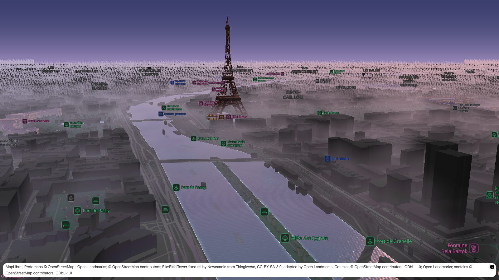

# maplibre-landmarks

3D for [MapLibre GL JS](https://maplibre.org), rendered with [three.js](https://threejs.org):
[Open Landmarks](https://open-landmarks.benmaps.fr) models, real roof shapes, trees,
volumetric fog, animated water and power lines, on one shared 3D core.

> [!WARNING]
> **Experimental and AI-generated.** This project is largely written with AI assistance and is
> still experimental: APIs may change without notice, and it has not been hardened for
> production use. Review it before relying on it.

**[Documentation](https://am2222.github.io/maplibre-landmarks/)** ·
**[Live demo](https://am2222.github.io/maplibre-landmarks/demo/)** ·
**[Roof gallery](https://am2222.github.io/maplibre-landmarks/demo/roofs-gallery.html)**

[](https://am2222.github.io/maplibre-landmarks/demo/?theme=dusk&fog=70#16/48.856/2.2905/60/78)

## Install

```sh
npm install maplibre-landmarks maplibre-gl three
```

## Example

```ts
import { LandmarksLayer, setTheme } from 'maplibre-landmarks';

map.on('load', () => {
  map.addLayer(new LandmarksLayer({ id: 'landmarks', replaceBuildings: ['buildings'] }), 'pois');
  setTheme(map, 'day');
});
```

Roofs, trees, fog, rain, snow, water and power lines: see the [guide](https://am2222.github.io/maplibre-landmarks/guide/getting-started).

## Development

```sh
npm install
npm run dev        # demo on http://localhost:5179 (needs VITE_PROTOMAPS_KEY in .env.local)
npm test           # unit tests; npm run test:browser for Playwright
npm run docs:dev   # documentation site
```

## Attribution and licences

Open Landmarks models are **CC BY 4.0** (artistic contributions) and contain OpenStreetMap-derived
data under **ODbL 1.0**; some models include other sources (e.g. IGN LiDAR HD, Licence Ouverte 2.0).
The layer adds the required attribution to MapLibre's attribution control automatically and exposes
it via `getAttribution()`. See https://open-landmarks.benmaps.fr/licenses/.

This library is MIT licensed. It is not affiliated with Open Landmarks or benmaps.fr.
